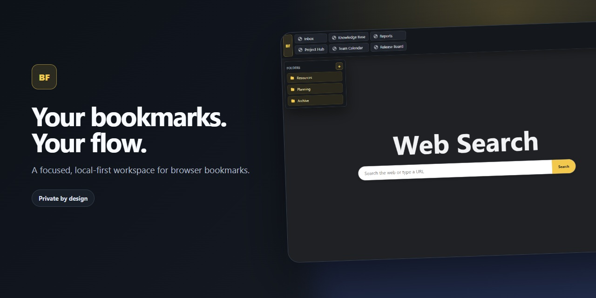
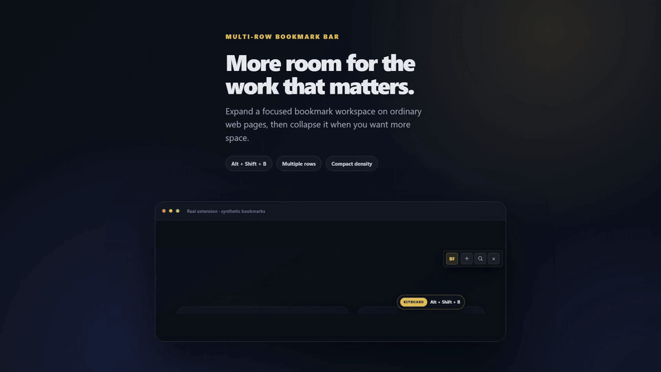
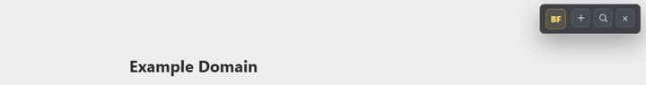
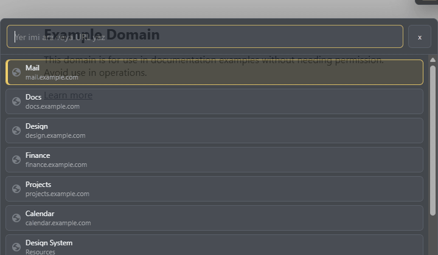
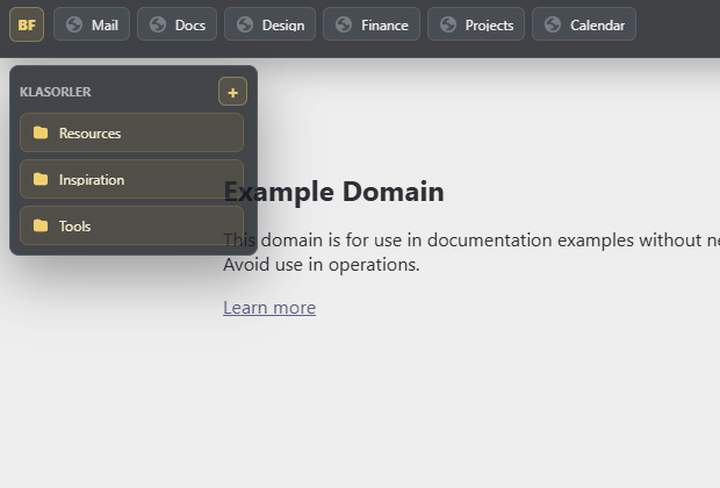
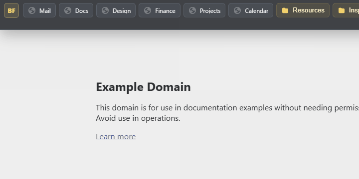
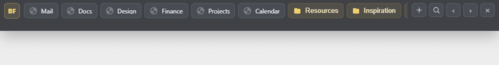

<p align="center">
  
</p>

<h1 align="center">BookmarkFlow Bar</h1>

<p align="center">
  A privacy-first Chrome extension that turns your bookmarks into a customizable multi-row bar, a keyboard-driven search palette, and an organized new-tab workspace.
</p>

<p align="center">
  <a href="https://github.com/mcolaker/BookmarkFlow-Bar/actions/workflows/validate.yml"></a>
  <a href="https://chromewebstore.google.com/detail/bookmarkflow-bar/iaikobkolclhhpcogacjkenijlfaibpf"></a>
  
  
  
  
  
  
</p>

<p align="center">
  <strong><a href="https://chromewebstore.google.com/detail/bookmarkflow-bar/iaikobkolclhhpcogacjkenijlfaibpf">Install from Chrome Web Store</a></strong> ·
  <a href="https://github.com/mcolaker/BookmarkFlow-Bar/releases/download/v0.1.43/bookmarkflow-bar-0.1.43.zip">Chrome ZIP</a> ·
  <a href="https://github.com/mcolaker/BookmarkFlow-Bar/releases/download/v0.1.43/bookmarkflow-bar-0.1.43-firefox.zip">Firefox ZIP</a> ·
  <a href="https://github.com/mcolaker/BookmarkFlow-Bar/releases/download/v0.1.43/bookmarkflow-bar-0.1.43-edge.zip">Edge ZIP</a> ·
  <a href="https://github.com/mcolaker/BookmarkFlow-Bar/releases/download/v0.1.43/bookmarkflow-bar-0.1.43.zip.sha256">Verify SHA-256</a> ·
  <a href="#install-from-source">Installation guide</a> ·
  <a href="https://mcolaker.github.io/BookmarkFlow-Bar/">Product website</a> ·
  <a href="https://github.com/mcolaker/BookmarkFlow-Bar/discussions">Join Discussions</a>
</p>

<p align="center">
  <sub><strong>Project status:</strong> Chrome Web Store listing live · verified v0.1.43 GitHub Release published · <a href="CHANGELOG.md">Changelog</a></sub>
</p>

> [!NOTE]
> **Privacy at a glance:** Your bookmark library stays in Chrome. BookmarkFlow has no analytics SDK or developer-operated server. The `<all_urls>` access exists only to render the optional in-page bar on ordinary websites. See [Privacy](#privacy-by-design) and [Permissions](#permissions) for the complete explanation.

<p align="center">
  <a href="#why-bookmarkflow">Why BookmarkFlow</a> ·
  <a href="#product-film">Product film</a> ·
  <a href="#feature-tour">Feature tour</a> ·
  <a href="#install">Install</a> ·
  <a href="#privacy-by-design">Privacy</a> ·
  <a href="ROADMAP.md">Roadmap</a> ·
  <a href="GOVERNANCE.md">Governance</a> ·
  <a href="#how-to-support">Support</a> ·
  <a href="https://mcolaker.github.io/BookmarkFlow-Bar/">Website</a> ·
  <a href="CONTRIBUTING.md">Contribute</a>
</p>

## Why BookmarkFlow

Chrome's native bookmarks bar is intentionally simple, but it cannot become a true multi-row workspace. BookmarkFlow adds a compact interface on top of regular web pages and replaces the new-tab page with a focused bookmark dashboard—without moving your bookmarks into a separate service.

- **See more at once.** Use multiple rows, compact density, horizontal scrolling, favicons, and readable titles.
- **Find anything at the speed of thought.** Spotlight / Raycast style real-time search palette with cyclic arrow navigation (`ArrowDown`/`ArrowUp`), active result highlight, and instant keyboard shortcuts.
- **Personalize your visual experience.** Switch effortlessly between 4 curated obsidian dark palettes: Gold Obsidian, OLED Midnight Black, Emerald Matrix, and Cyber Indigo, with instant real-time sync across popup, new tab, and page bar.
- **Focused New Tab with Quick Shortcuts.** Minimalist ambient start page featuring a real-time digital clock, contextual greetings, and an 8-item Quick Shortcuts grid built from your top bookmarks.
- **Organize without duplication.** Work with the folders already stored in your browser and pin important folders to a left or right rail.
- **Stay presentation-ready.** Streamer mode reduces bookmark labels to icons when you share your screen.
- **Cross-browser flexibility.** Native packages and support for Chromium browsers (Chrome, Edge, Brave, Opera) and Mozilla Firefox.
- **Adapt it per site.** Hide BookmarkFlow on selected domains or automatically suppress it on login, payment, and banking pages.
- **Keep control of your data.** 100% local-first architecture. No analytics, external account, or cloud service is required.

## Product film

<p align="center">
  <br>
  <sub><strong>Motion summary:</strong> A compact BF control expands into a multi-row bookmark bar on a synthetic local demonstration page. The preview plays once and contains no personal browser data.</sub>
</p>

<p align="center">
  <strong><a href="https://github.com/mcolaker/BookmarkFlow-Bar/releases/download/v0.1.38/bookmarkflow-bar-master-1920x1080.mp4">Watch the full 58-second product film</a></strong> ·
  <a href="docs/assets/promo-video/bookmarkflow-bar-poster-1920x1080.jpg">View the 1920×1080 poster</a> ·
  <a href="media/promo-video/README.md">Reproduce the 58-second film and social cutdowns</a> ·
  <a href="https://github.com/mcolaker/BookmarkFlow-Bar/releases/download/v0.1.38/bookmarkflow-bar-master.en.srt">Download English captions</a> ·
  <a href="https://github.com/mcolaker/BookmarkFlow-Bar/releases/download/v0.1.38/bookmarkflow-bar-product-film-SHA256SUMS.txt">Verify film SHA-256</a>
</p>

The full film is generated from reviewed repository media and real extension captures made with synthetic bookmarks in an isolated temporary Chrome profile. The approved master is published as a separate GitHub Release asset and never enters the extension source or Chrome ZIP; the tracked production workspace records the exact compositions, dependencies, safety boundaries, captions, and output contract.

## Feature tour

> [!TIP]
> Motion previews use synthetic test bookmarks, include a visible interaction cue, and play once. Each preview also has a text summary, so the feature remains understandable without relying on animation.

### A bookmark bar that fits your workflow

Expand the compact `BF` control only when you need it. Choose the number of rows, visual density, page spacing behavior, and whether the bar appears on regular websites.

<p align="center">
  <br>
  <sub><strong>Motion summary:</strong> Use <kbd>Alt + Shift + B</kbd> to expand or collapse the bar; the preview finishes with two bookmark rows visible.</sub>
</p>

### Search from anywhere with Spotlight keyboard navigation

Open the bookmark palette with the search button or <kbd>Alt + Shift + K</kbd>. Type to see real-time suggestions, cycle through results with <kbd>↓</kbd> / <kbd>↑</kbd>, and press <kbd>Enter</kbd> to launch immediately, or <kbd>Ctrl + Enter</kbd> to open in a new tab.

<p align="center">
  <br>
  <sub><strong>Motion summary:</strong> Open search with the search button or its reassigned extension shortcut, type a query, and move through results with the arrow keys.</sub>
</p>

### Curated obsidian dark themes

Personalize your workspace with 4 handcrafted dark palettes:
- **Gold Obsidian:** Classic deep navy (`#0b0f19`) with warm gold (`#f2c94c`) accent.
- **OLED Midnight Black:** True pure black (`#000000`) with high-contrast platinum silver (`#f8fafc`).
- **Emerald Matrix:** Cyber obsidian (`#061009`) with vivid neon emerald (`#41d17d`).
- **Cyber Indigo:** Synthwave violet night (`#0a0918`) with electric indigo (`#818cf8`).

Switch themes from the popup; your selection syncs across the popup, New Tab dashboard, and in-page bar in real time without reloading tabs.

<p align="center">
  <a href="https://github.com/mcolaker/BookmarkFlow-Bar/releases/tag/v0.1.43"></a><br>
  <sub><strong>Visual showcase:</strong> Spotlight keyboard search palette and 4 curated obsidian color themes.</sub>
</p>

### Focused New Tab with Quick Shortcuts

Transform empty tabs into an intentional dashboard. Enjoy a real-time digital clock synchronized to your local time, contextual greetings, and an 8-item Quick Shortcuts grid automatically populated from your most-used bookmarks.


### Pin the folders that matter

The optional folder rail can sit on the left or right. Pinned folders are stored by Chrome bookmark ID, so they remain selected independently of their position in the bookmark tree.

<p align="center">
  <br>
  <sub><strong>Motion summary:</strong> Select a pinned folder from the left rail to open its bookmarks without leaving the current page.</sub>
</p>

### Manage bookmarks in context

Right-click a bookmark or folder to open, copy, rename, add, delete, or reorder it. Folder menus also let you assign colors—without interrupting the page you are viewing.

<p align="center">
  <br>
  <sub><strong>Motion summary:</strong> Right-click a bookmark to reveal open, copy, rename, reorder, and delete actions without leaving the current page.</sub>
</p>

### Share your screen with less visual noise

Streamer mode switches bookmark labels to an icon-focused presentation in the bar and folder menus.

<p align="center">
  <br>
  <sub><strong>Motion summary:</strong> Use <kbd>Alt + Shift + M</kbd> to switch the expanded bar from bookmark labels to an icon-focused view.</sub>
</p>

## Install

For most users, install the published extension from the [Chrome Web Store](https://chromewebstore.google.com/detail/bookmarkflow-bar/iaikobkolclhhpcogacjkenijlfaibpf). Chrome will manage installation and approved updates for the same extension ID.

### Install from source

For development, auditing, or reproducible source installation, use a versioned release package rather than an arbitrary working tree.

1. Download the verified [`bookmarkflow-bar-0.1.43.zip`](https://github.com/mcolaker/BookmarkFlow-Bar/releases/download/v0.1.43/bookmarkflow-bar-0.1.43.zip) package and extract it. Its published [SHA-256 checksum](https://github.com/mcolaker/BookmarkFlow-Bar/releases/download/v0.1.43/bookmarkflow-bar-0.1.43.zip.sha256) is available for integrity verification. Contributors can clone the repository instead:

   ```bash
   git clone https://github.com/mcolaker/BookmarkFlow-Bar.git
   ```

2. Open `chrome://extensions` in Chrome.
3. Enable **Developer mode** in the top-right corner.
4. Select **Load unpacked** and choose the repository folder containing `manifest.json`.
5. Follow the built-in onboarding tour.

For the cleanest experience, hide Chrome's native bookmarks bar with `Ctrl + Shift + B`. This only changes its visibility; it does not delete bookmarks. BookmarkFlow continues to read the same Chrome bookmark data.

## Keyboard shortcuts

| Action | Default shortcut |
| --- | --- |
| Open or close search | `Alt + Shift + K` |
| Expand or collapse the bar | `Alt + Shift + B` |
| Hide or restore BookmarkFlow | `Alt + Shift + H` |
| Toggle streamer mode | `Alt + Shift + M` |

Shortcuts can be reassigned at `chrome://extensions/shortcuts`. The popup and onboarding page read the actual Chrome assignment, so an unassigned or customized command is shown accurately.

## Privacy by design

BookmarkFlow is designed to work with Chrome's existing bookmark system rather than copying your library to an external service.

- Bookmark titles, URLs, and folders remain in Chrome's bookmark storage.
- Bookmark, page-context, preference, and search features stay off until the user accepts the prominent first-run privacy disclosure.
- BookmarkFlow has no analytics SDK, advertising SDK, remote API, or project-operated server.
- General display preferences may follow the browser through Chrome Sync when sync is enabled.
- The per-site hide list, pinned folder selections, and per-folder colors are stored locally on the device because Chrome bookmark IDs are profile-specific.
- Only `http:`, `https:`, and `mailto:` bookmark URLs are rendered or opened.
- The in-page interface runs inside a closed Shadow DOM to reduce interference from page styles and scripts.

See the public [privacy policy](https://mcolaker.github.io/BookmarkFlow-Bar/privacy/), repository [privacy source](store/privacy-policy.md), and [security policy](SECURITY.md).

## Languages and accessibility

BookmarkFlow uses Chrome's native extension localization system. English is the default interface language, and Turkish is included as a complete additional locale. The interface follows the browser's UI language automatically.

Keyboard navigation, visible focus states, reduced-motion preferences, semantic labels, and privacy-conscious empty search states are built into the main surfaces. Accessibility is treated as an ongoing product requirement; report a reproducible issue through [GitHub Issues](https://github.com/mcolaker/BookmarkFlow-Bar/issues).

## Permissions

| Permission | Why it is needed |
| --- | --- |
| `bookmarks` | Read and manage the user's Chrome bookmark tree for the bar, search, folders, and context actions. |
| `storage` | Save layout, appearance, onboarding, local site exclusions, and other extension preferences. |
| `favicon` | Display Chrome-managed favicons beside bookmarks without contacting a third-party icon service. |
| `search` | Send user-submitted new-tab web searches to the search provider already selected in Chrome. |
| `<all_urls>` | Place the optional in-page bookmark interface on ordinary websites. Chrome-protected pages remain inaccessible to extensions. |

## Built with a small, auditable stack

The BookmarkFlow extension runtime uses Manifest V3, semantic HTML, CSS, and vanilla JavaScript. It has no runtime package dependencies and no build step. The optional dev-only `media/promo-video/` workspace has its own exact, locked dependencies and never enters the Chrome extension package.

```text
BookmarkFlow-Bar/
├── _locales/                 English and Turkish Chrome translations
├── manifest.json              Extension entry point and permissions
├── icons/                     BF application icons
├── src/                       Popup, new tab, onboarding, and content UI
├── scripts/                   Local validation and regression checks
├── store/                     Store listing, privacy, and QA materials
├── media/                     Dev-only, reproducible promotional media source
└── docs/                      Public product, preview, and privacy pages
```

## Local validation

With Node.js 20 or newer installed:

```bash
node scripts/validate-backlog.mjs
node --test scripts/backlog-contract.test.mjs
node scripts/validate-open-source.mjs
node --test scripts/open-source-contract.test.mjs scripts/dco-contract.test.mjs scripts/package-release-contract.test.mjs
node --test scripts/runtime-contract.test.mjs scripts/ui-behavior-contract.test.mjs
node scripts/validate-project.mjs
node scripts/verify-public-tree.mjs
node scripts/security-regression.mjs
```

The backlog, open-source, DCO, project, and public-tree checks are platform-independent. The browser regression check additionally requires a locally installed Chromium-based browser.

Maintainers can create a versioned extension ZIP and SHA-256 checksum from a release tag with `node scripts/package-release.mjs v0.1.41`.

## Browser limitations

- Content scripts cannot run on `chrome://` pages, the Chrome Web Store, and other browser-protected surfaces.
- The new-tab experience uses a dedicated extension page because Chrome's default new tab is protected.
- BookmarkFlow is an in-page overlay, not a modification of Chrome's native toolbar.
- Sites with complex fixed headers may require the **Push page content** or **Place below overlapping headers** setting.
- Folder merge detection uses bookmark synchronization metadata available in Chrome 134 and later.

## How to support

If BookmarkFlow improves your daily browsing, choose the route that matches how you want to help.

### Try it

- **Install BookmarkFlow Bar from its [Chrome Web Store listing](https://chromewebstore.google.com/detail/bookmarkflow-bar/iaikobkolclhhpcogacjkenijlfaibpf)** for the normal update path.
- **Download the [verified v0.1.41 source release](https://github.com/mcolaker/BookmarkFlow-Bar/releases/tag/v0.1.41)** for audit or development use and follow the [source installation guide](#install-from-source).
- **Read the [product website](https://mcolaker.github.io/BookmarkFlow-Bar/)** and privacy documentation before installing.

### Support the project

- **Star the repository** to help more Chrome users discover the project.
- **Watch releases** to follow verified packages and important product updates.
- **Join [GitHub Discussions](https://github.com/mcolaker/BookmarkFlow-Bar/discussions)** to ask questions, share workflows, suggest ideas, and help other users.
- **Share BookmarkFlow** with people who want faster bookmark access without moving their library to a separate service.

### Contribute

- **Report reproducible bugs or focused feature requests** through [GitHub Issues](https://github.com/mcolaker/BookmarkFlow-Bar/issues).
- **Start with a [`good first issue`](https://github.com/mcolaker/BookmarkFlow-Bar/labels/good%20first%20issue)** or a [`help wanted`](https://github.com/mcolaker/BookmarkFlow-Bar/labels/help%20wanted) task.
- **Test new releases** or contribute accessibility, localization, documentation, and narrowly scoped code improvements.

For additional support routes, see [SUPPORT.md](SUPPORT.md). For security vulnerabilities, do not open a public issue or discussion; follow the private reporting process in [SECURITY.md](SECURITY.md).

The source code is available under Apache License 2.0, including the rights to use, modify, and redistribute it under that license. Publicly distributed forks must use a distinct product identity and must not imply that they are official BookmarkFlow Bar builds; see [TRADEMARKS.md](TRADEMARKS.md).

## Contributing

Bug reports and focused improvements are welcome. Read [CONTRIBUTING.md](CONTRIBUTING.md), the [Code of Conduct](CODE_OF_CONDUCT.md), and the [project governance](GOVERNANCE.md) before participating. Contributions use the [Developer Certificate of Origin](DCO). Use the repository's issue templates for reproducible bugs and feature proposals. Please report security concerns privately as described in [SECURITY.md](SECURITY.md).

## License

BookmarkFlow Bar is open-source software licensed under [Apache License 2.0](LICENSE.md). Attribution information is in [NOTICE](NOTICE). The software license does not grant rights to the BookmarkFlow Bar, BF, or Maprins Games marks; see [TRADEMARKS.md](TRADEMARKS.md) for the official-build and brand policy.
